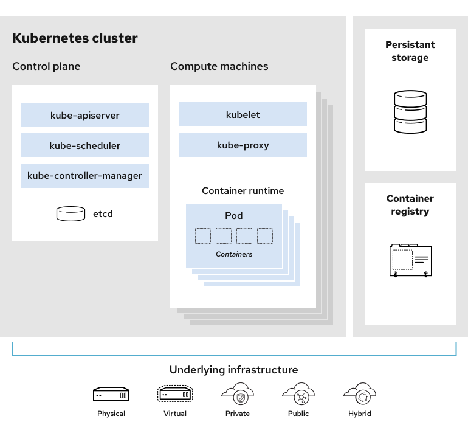

# mini-k8s-2023

## Supported instructions for now:
kubectl get nodes/pods/services

kubectl describe node NODE_NAME

kubectl describe pod POD_NAME

kubectl describe service SVC_NAME

kubectl create --file/-f FILE_PATH

kubectl del pod POD_NAME/POD_YAML_PATH

## k8s original structure

## NOTE
In every iteration, every should create a new branch named "OOO-iterX" and DO NOT develop in the master branch directly!

## command-line programming
https://juejin.cn/post/6904184013381255181

## go yaml analysis tools
https://juejin.cn/post/7178146763927683127

## "docs" directory
documents

## "components" directory
every single component of this project, such as pod.

## "defines" directory
definition required for every component.

## "config" directory
some const definition required in the project.

## "scripts" directory
some scripts required when doing test for some part of the project.

## "test" directory
(not sure) some tests required by CI/CD.

## "utils" directory
some utils required when implementing components, such as yaml-parsing.

## current solution when meeting problem "dial tcp XX.XX.XX.XX: connect: connection refused"
https://blog.csdn.net/fanjufei123456/article/details/124660294

## using goLang to read stdin information
https://tool.4xseo.com/a/24877.html

## image used in pause container in every pod
registry.cn-hangzhou.aliyuncs.com/google_containers/pause:3.6

## about etcd
download etcd;
set config for etcd;
run "etcd" in terminal;

## about CadVisor
download path: https://github.com/google/cadvisor/releases/cadvisor-v0.47.0-linux-amd64
then run : sudo ./cadvisor-v0.47.0-linux-amd64

## parsing cmd line info(not interactive version)
https://blog.csdn.net/guanchunsheng/article/details/79612153

## how to read data from a io.ReaderCloser
https://blog.csdn.net/weixin_33688840/article/details/91897048

## about network CNI(v1)
See network.md

## about "Error response from daemon: client version 1.YY is too new. Maximum supported API version is 1.XX"
https://blog.csdn.net/susu_xi/article/details/118077749

and use the const defines in config: DockerApiVersion.